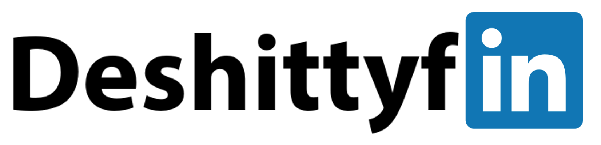
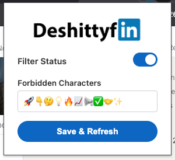

# DeshittyfIn



A simple browser extension to make LinkedIn a bit less shitty by hiding posts containing cringy emojis.

## Usage



The extension is really simple: activate the "Filter Status" toggle, add some more shitty emojis you never want to see in your feed, and click the big button!

## Default Blocklist
By default, the extension targets the following cringy and engagement-farming emojis:
```
🚀👇🤔💡🔥📈📢✅🤝✨
```

## Download & Setup
### Chrome-based Browsers
- Download or clone this repo
- open your browser and visit `chrome://extensions/`
- Enable developer mode using the top-right corner
- Click "Load Unpacked" and select the previously downloaded folder

Now you can browse a bit less shitty version of LinkedIn. Congrats!
